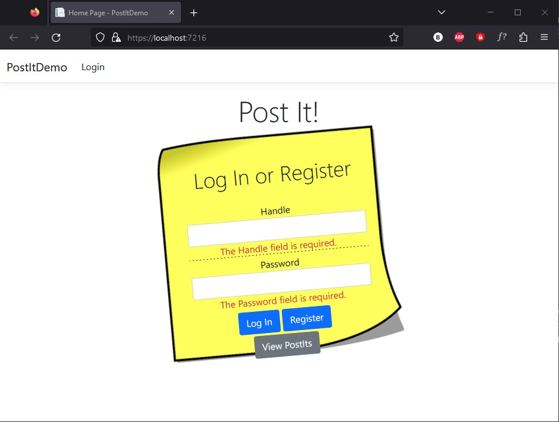
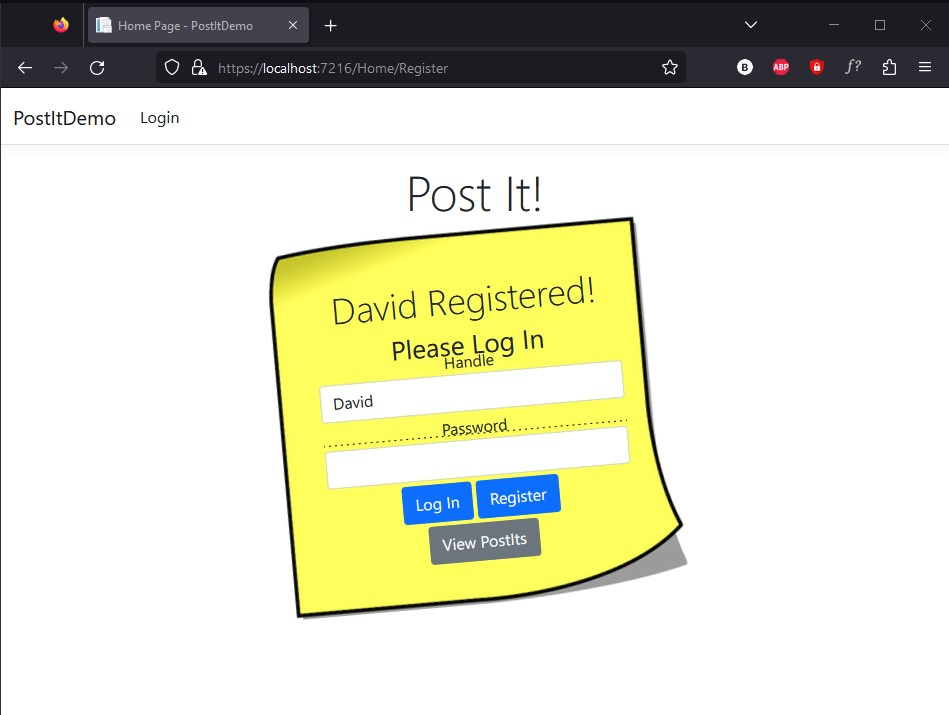
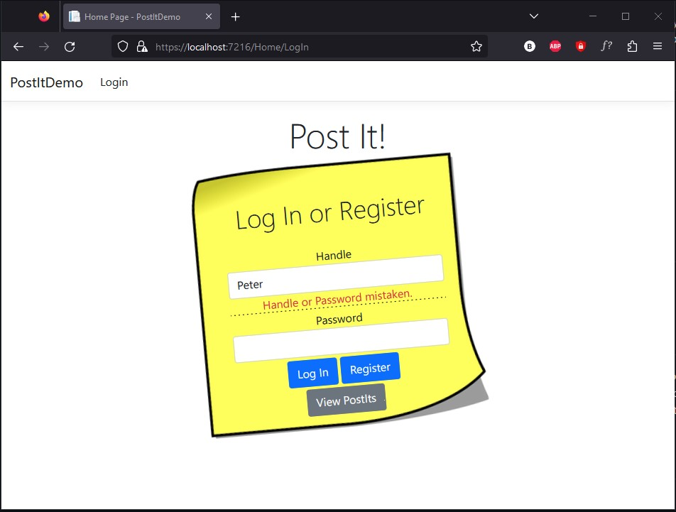
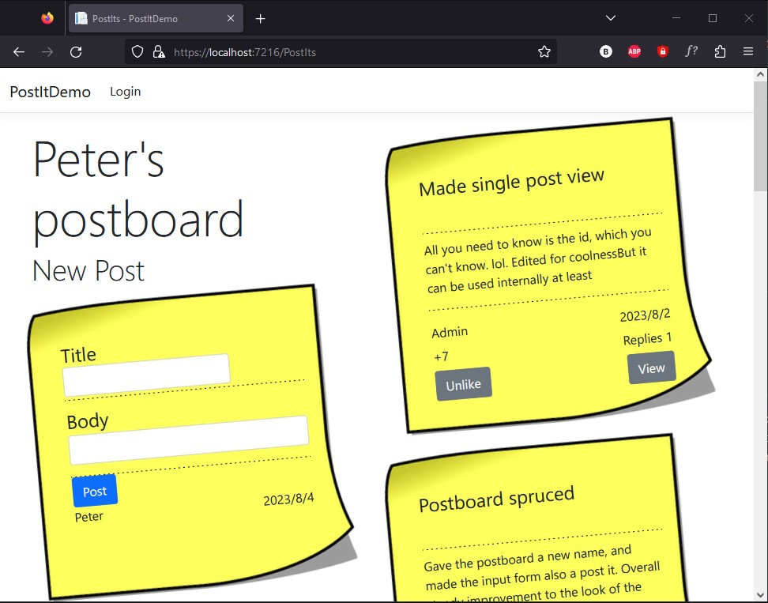
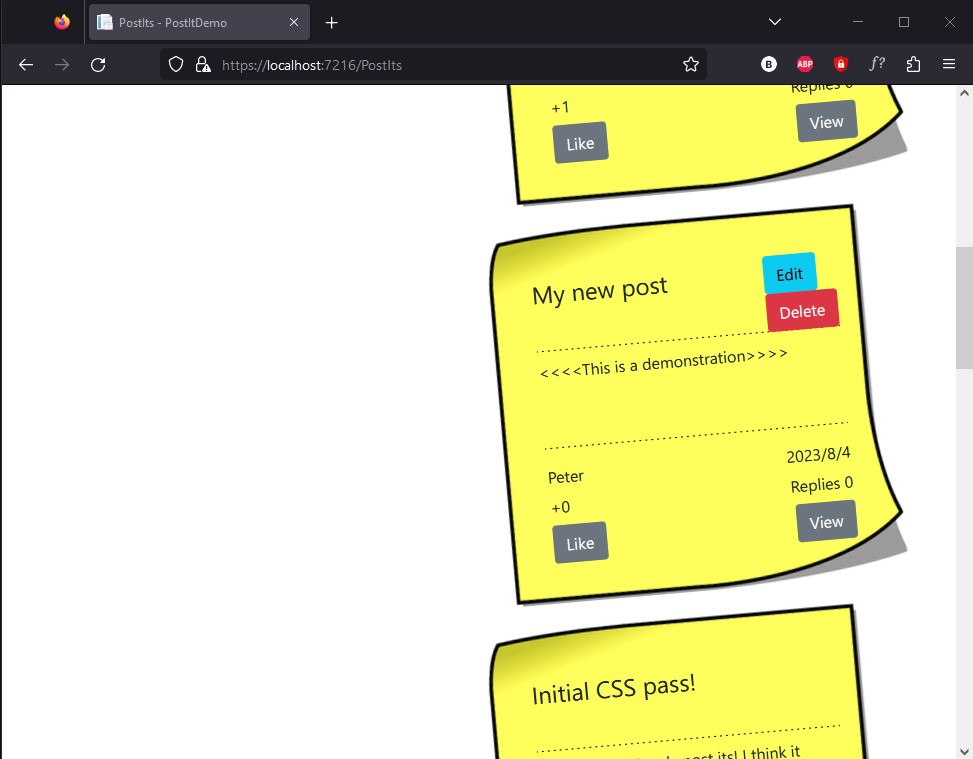
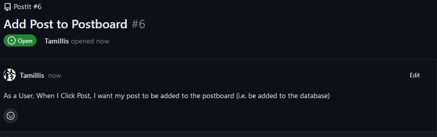

# PostIt
A C# .NET Entity Framework MVC Web App demonstration.

A very simple twitter clone where users can register & log in, post short messages with a title and a body, see everyone's posts organised by relevance (a simple recency + likes formula) and leave comment posts, i.e. posts that are anchored to some other post.

## Feature List
- Cookie-based Registration, with and Sign In and Sign Out.
  - Usernames (Handles) and Passwords (hashed) stored directly on database
- Ability to make posts anonymously if not logged in
- A main postboard view where all posts can be seen and interacted with
- A per-post view where comment posts can be left, other comment posts seen
- Can Edit and Delete your own posts, but not others'

### Wanted Feature List
- Pagination
- API endpoints

## Current State of the Project
Sprint 1 is complete as of this push. Ready to start sprint 2, which doubles as a demonstration of the entire sprint process. There will be links to a kanban board, User Stories, Figma design board, a metro retrospective and a redone README suitable for the project. The README will contain an example of a User Story, its breakdown into SpecFlow Unit Tests, the result of those tests (passing) and then a short section on the code that makes it pass, all together functioning as a demonstration of TDD.

### Login Page

### User Registration

### Wrong Password

### Postboard

### New Post

## QA Demonstration
A quick demonstration of Unit testing can be found in the code [here](./PostItsTests/UtilsTests.cs)

TODO Create service layer and through that demonstrate SpecFlow Unit Testing of data.

## User Journey Demonstration
Here is a demonstration of one user story, and its implementation throughout the project in a step by step manner; a workflow known as Test Driven Development.
### #1 User Story 

### #2 Tests 
TODO (Unit testing project code screenshot)
### #3 Implementation 
TODO (Code implementation screenshot)

### #4 Product 
TODO (website screenshot/s)

## KANBAN Board

https://github.com/users/Tamillis/projects/2

## Figma Design
[Home Page Design](https://www.figma.com/file/1JO25scDlwgyS5pMxvU0Cb/PostIts-Homepage?type=design&node-id=0%3A1&mode=design&t=wMqsCHv867fsVw1f-1)

I am not a designer, but this will do as a demonstration of "this is what I want you to make", and then the real site being how close I can get to that.

## Metroretro Retrospective
TODO

## Installation

Under releases, download the provided .zip, unzip and, using Visual Studio (with ASP.NET and web development & SQL Server installed), open the .sln, click run.

For the latest development iteration: clone the repo and load the .sln with Visual Studio (with ASP.NET and web development & SQL Server installed), and click run.
